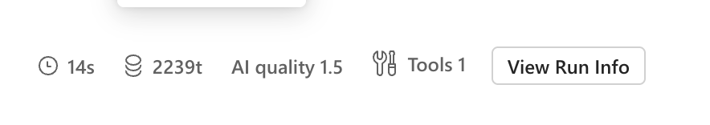

# Create an Agent in Microsoft Foundry - Complete Guide

This guide walks you through creating your first agent in Microsoft Foundry from start to finish. We will be building a basic agentic system using three agents.

## Prerequisites

✅ Azure subscription with access to Azure AI Foundry  

## Step 1: Access Azure AI Foundry

1. Navigate to [https://ai.azure.com](https://ai.azure.com)
2. Sign in with your Azure credentials
3. Select your subscription and resource group

## Step 2: Create or select a project

Select an existing project or create a new project using the instructions [here](https://learn.microsoft.com/en-us/azure/ai-foundry/how-to/create-projects?view=foundry-classic&tabs=foundry).

## Step 3: Create a model deployment

If do not have a gpt-4o deployment, create it following the instructions [here](https://learn.microsoft.com/en-us/azure/ai-foundry/quickstarts/get-started-code?view=foundry-classic&tabs=python%2Cpython2).

The instructions in the guide use gpt-4o, but you can try any other model if you'd like. 

## Step 3: Navigate to Agent Creation

1. In your project, look for **"Agents"** in the left navigation

2. Click **"New agent"**

## Step 4: Configure Agent Settings
We will be creating three agents.
### Router Agent
Select the newly created agent and fill below information on the right panel.
1. `SFI-helper-agent` in `Agent name` field
2. Select `gpt-4o` in `Deployment` field
3. Fill below text in Instructions field:
```md
    You are the Router Agent. Your job is to decide:
    - If the user asks for a summary → route to Summarizer.
    - If the user asks a question → route to Q&A.
    If unclear, ask one short clarifying question.
    Output: route only (Summarizer or Q&A).

```
### Summarizer Agent
Select the newly created agent and fill below information on the right panel.
1. `SFI-summarizer-agent` in `Agent name` field
2. Select `gpt-4o` in `Deployment` field
3. Fill below text in Instructions field:
```md
    You are the Summarizer Agent. Summarize the provided text clearly and concisely.
    - Use bullet points for key ideas.
    - Keep it short and easy to read.
    - Use only the given text. If info is missing, say so.

```
4. Add Knowledge Source
- Click `Add` in **"Knowledge"** section
- Click on `files` tile
- Select `Create a new vector store` under Vector store and name it `SFIVectorStore`
- Click `Select local files` to upload the file which you were asked to download during bootcamp. If you do not have that file, you can download a file from [this link](https://arxiv.org/pdf/2402.06196) or choose any file of your choice.
- Click `upload and save`

### Q&A Agent
Select the newly created agent and fill below information on the right panel.
1. `SFI-qna-agent` in `Agent name` field
2. Select `gpt-4o` in `Deployment` field
3. Fill below text in Instructions field:
```md
    You are the Q&A Agent. Answer the user’s question using only the provided text.
    - Be clear and direct.
    - If the answer is not in the text, say: “The document does not contain that information.”
```
4. Add Knowledge Source
- Click `Add` in **"Knowledge"** section
- Click on `files` tile
- Select `Select an existing vector store` under Vector store and choose `SFIVectorStore` created during summarizer agent creation.
- Click `select`


## Step 5: Set up connected agents for orchestration

Learn more about connected agents in Azure AI Foundry [here](https://learn.microsoft.com/en-us/azure/ai-foundry/agents/how-to/connected-agents?view=foundry-classic&pivots=portal).

### Add Summarizer agent
1. Select the `SFI-helper-agent` agent and scroll down in the right panel to find `Connected agents` field and click `Add`

2. Select the `SFI-summarizer-agent` in `Agent` and `summarizer` in `Unique name`.
3. Fill below text in `Detail the steps to activate the agent`:

```md
If the user asks for summary, this agent should be invoked.
```

4. Click `Add`.


### Add Q&A agent
1. Select the `SFI-helper-agent` agent and scroll down in the right panel to find `Connected agents` field and click `Add`

2. Select the `SFI-qna-agent` in `Agent` and `qna` in `Unique name`.
3. Fill below text in `Detail the steps to activate the agent`:

```md
If the user asks any question other than summary, this agent should be invoked.
```

4. Click `Add`.


## Step 6: Test Your Agentic system

1. Select the `SFI-helper-agent` agent and click `Try in playground`.
2. In the chat box, type prompts. Type "summarize the report".
3. Router agent should call "SFI-summarizer-agent" to answer this query. You can verify this by clciking on "View Run Info".

4. Try a few prompts see if it works correctly. You can also try asking some questions to see in what cases it can't route properly.
5. You can also change instructions in any of the agents to change the behaviour.

**🎉 Congratulations!** You've successfully created your agent in Microsoft Foundry. 